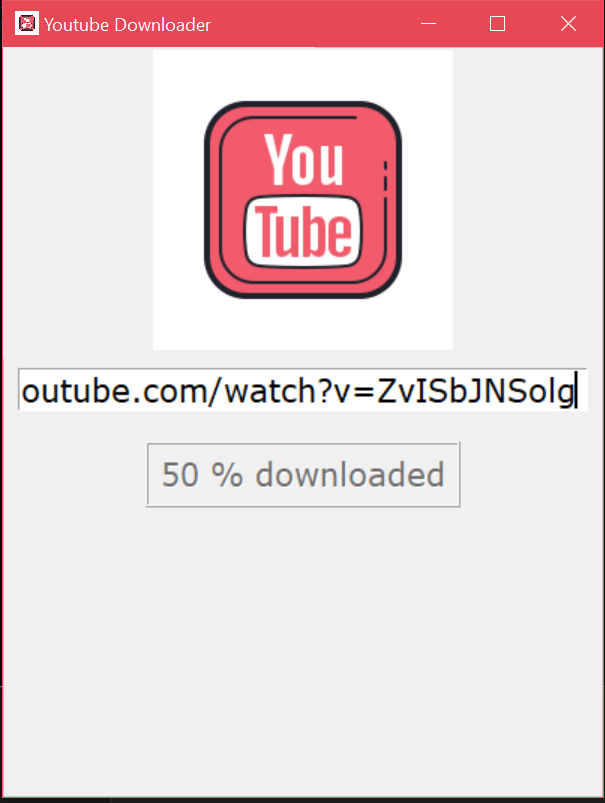

# Youtube-video-downloader-using-Python

Using python modules made a youtube downloader including GUI 

## modules needed
 
1.pytube
 
2.tkinter
 
## To download these modules use pip commands
 
1.pip install pytube
 
2.pip install tkinter

## GUI looks like 

